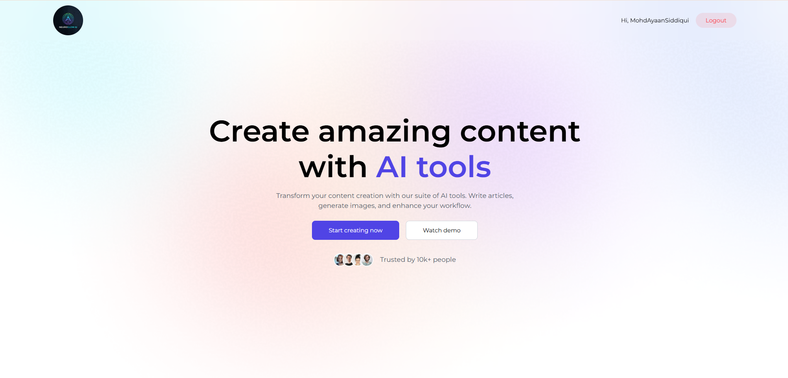
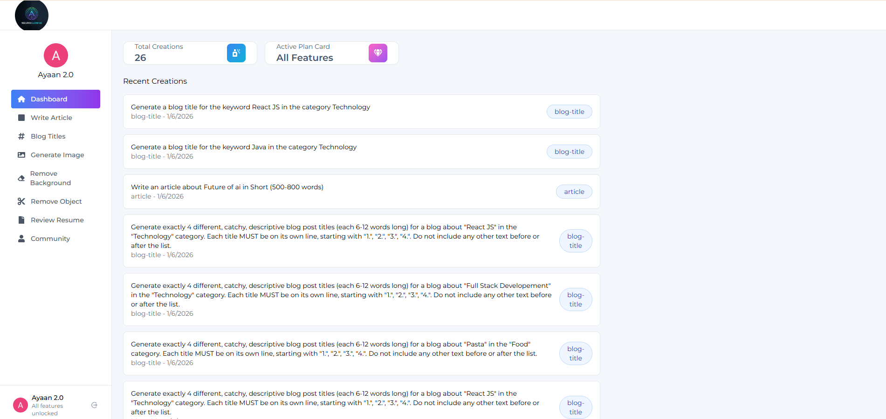
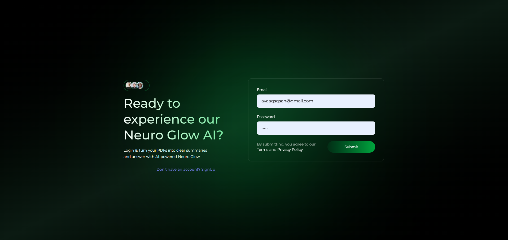
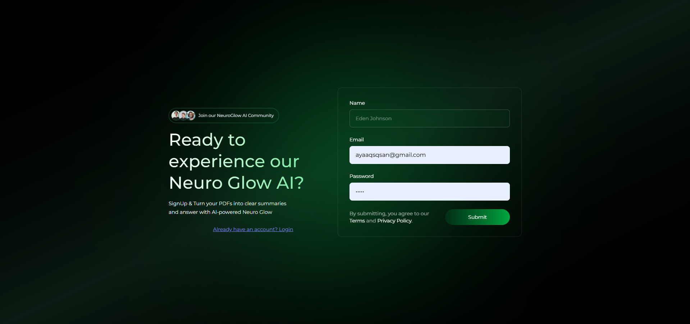
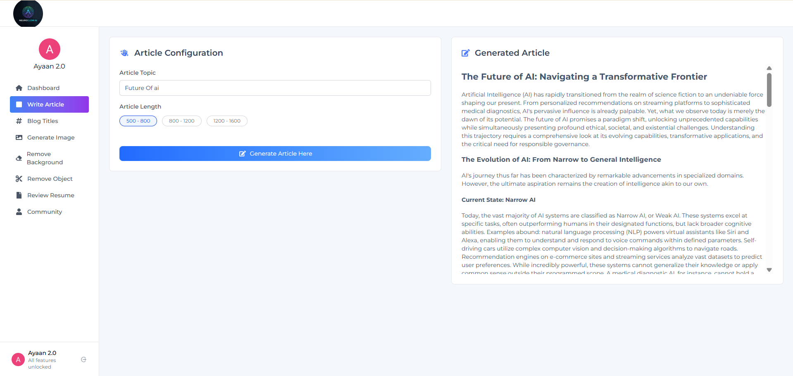
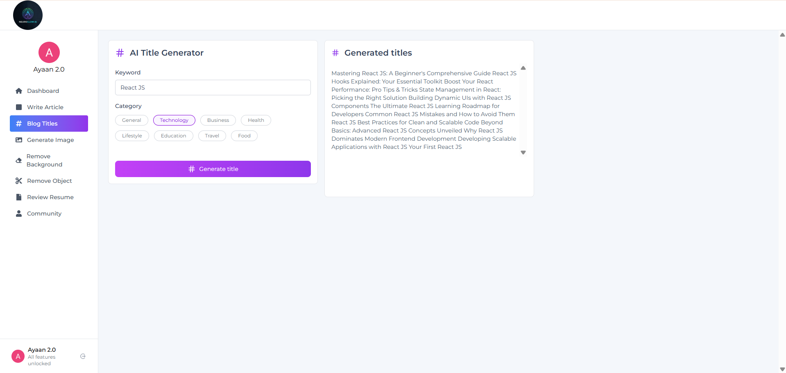
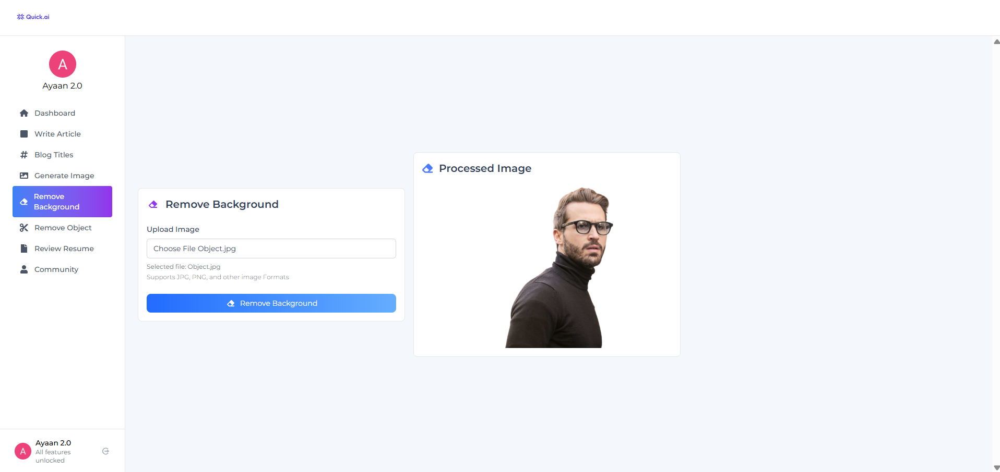
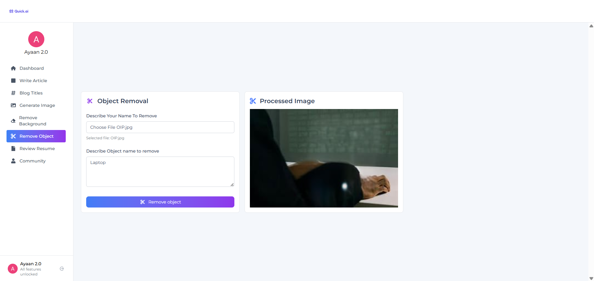

# AI-Powered SAAS App

NeuroGlow.ai is a modern AI SaaS application built on the **MERN stack** (MongoDB, Express.js, React.js, Node.js), offering a suite of smart tools for content generation and image manipulation—all within a beautiful, responsive dashboard.

## Features

- **Generate Article** – AI-powered article writing based on custom prompts.
- **Generate Blog Title** – Smart blog title generation to match your content.
- **Remove Background** – Clean background removal with PNG output.
- **Remove Object** – Seamlessly erase unwanted elements from images.
- **Dashboard** – View and manage your content generation history.
- **Community Feed** – Share your generated images with others and toggle likes.

---
---

## Project Structure

```bash
Ai-Powered-SaaS-App/
│
├── client/                 # Frontend (React + Vite, Redux)
│   ├── components/         # Reusable UI components
│   └── pages/              # Main application pages
│
├── server/                 # Backend (Node + Express)
│   ├── routes/             # All API routes
│   ├── controllers/        # Users, AI features
│   ├── models/             # Schemas
│   └── config/             # Cloudinary, PDF, Multer
│
├── .env                    # Environment variables
└── README.md               # Project documentation
```

## How To Run This File

**In Client**
```bash
cd client
npm install 
npm run dev
```

**In Server**
```bash
cd server
npm install
nodemon server.js
```

## Environment Variable Setup

### Client
`VITE_BASE_URL=http://localhost:3000`

### Server
```bash
MONGO_URI=xxxx
GEMINI_API_KEY=xxxx
CLOUDINARY_CLOUD_NAME=xxxx
CLOUDINARY_API_KEY=xxxx
CLOUDINARY_API_SECRET=xxxx
```

## Screenshots

<p align="center">
  
</p>

<p align="center">
  
</p>

<p align="center">
  
</p>

<p align="center">
  
</p>

<p align="center">
  
</p>

<p align="center">
  
</p>

<p align="center">
  
</p>

<p align="center">
  
</p>

<p align="center">
  
</p>

## Good Luck
