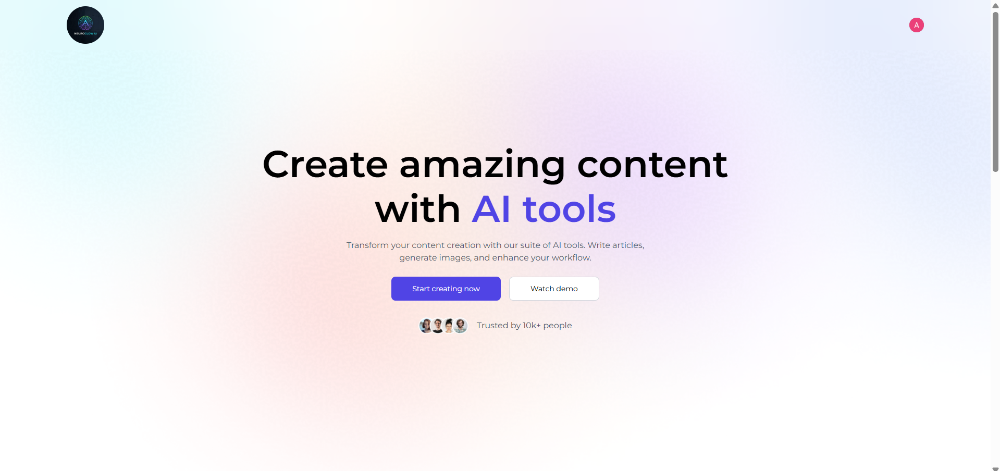

# AI-Powered SAAS App

Quickgen.ai is a modern AI SaaS application built on the **PERN stack** (PostgreSQL, Express.js, React.js, Node.js), offering a suite of smart tools for content generation, image manipulation, and resume reviews - all within a beautiful, responsive dashboard.

---

## Features

- **Generate Article** – AI-powered article writing based on custom prompts.
- **Generate Blog Title** – Smart blog title generation to match your content.
- **Generate Image** – Create AI-generated images with prompts.
- **Remove Background** – Clean background removal with PNG output.
- **Remove Object** – Seamlessly erase unwanted elements from images.
- **Review Resume** – Intelligent resume analysis and feedback system.
- **Dashboard** – View and manage your content generation history.
- **Community Feed** – Share your generated images with others and toggle likes.

---
---

## Project Structure

```bash
Ai-Powered-SaaS-App/
│
├── client/                 # Frontend (React + Vite)
│   ├── components/         # Reusable UI components
│   └── pages/              # Main application pages
│
├── server/                 # Backend (Node + Express)
│   ├── routes/             # All API routes
│   ├── controllers/        # Users, AI features
│   └── config/             # Cloudinary, PDF, Multer
│
├── .env                    # Environment variables
|__ README.md               # Project documentation

```
---

## How To Run This File

**In Client**
cd client
npm install 
npm run dev

**In Server**
cd server
npm install
nodemon server.js

##Envoirnmental Variable SetUp
## Client
--VITE_CLERK_PUBLISHABLE_KEY=xxxx
--VITE_BASE_URL=http://localhost:3000

## Server

--DATABASE_URL=xxxx
--CLERK_PUBLISHABLE_KEY=xxxx

--CLERK_SECRET_KEY=xxxx

--GEMINI_API_KEY=xxxx

--CLIPDROP_API_KEY=xxxx

--CLOUDINARY_CLOUD_NAME=xxxx
--CLOUDINARY_API_KEY=xxxx
--CLOUDINARY_API_SECRET=xxxx

## Good Luck

<p align="center">
  
</p>

<p align="center">
  
</p>


<p align="center">
  
</p>

<p align="center">
  
</p>


<p align="center">
  
</p>

